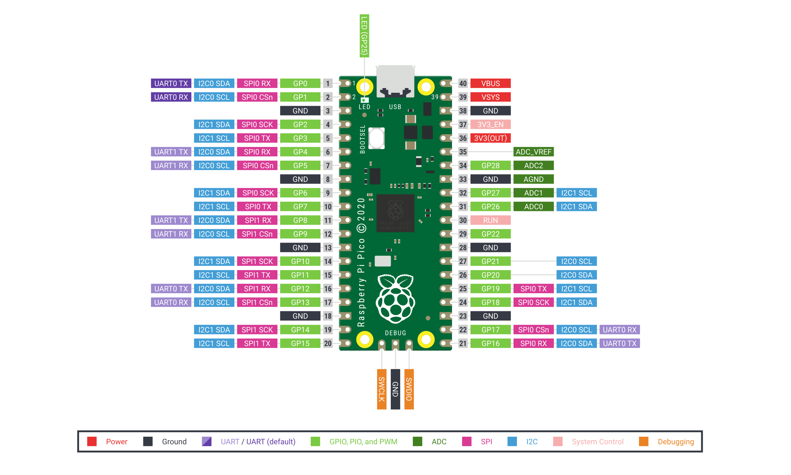
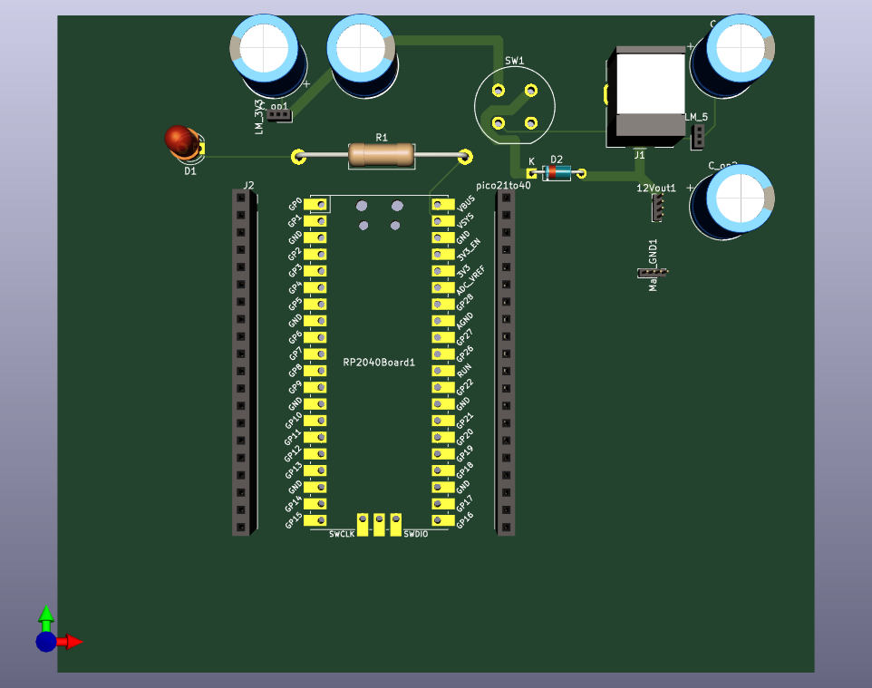
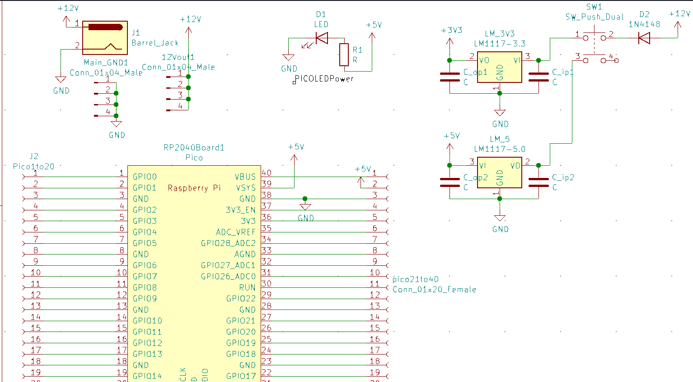

# RP2040_Dev_Board
Kicad PCB design for a RP2040 Development Board Designed to make the RP2040 more beginner friendly
## Features to Implement
- [X] Add Female headers to the PCB to directly connect with pico
- [X] Add 12V/5V and 3.3V Power  
- [ ] Add LEDs
  - [ ] Power LED
  - [ ] Blink LED
- [ ] Add Battery power circuit    
- [ ] Add slots for Basic sensors like DHT11, 22, LDR, etc.
- [ ] Add motor driver for stepper, DC, BLDC etc.
- [ ] Add protection circuit
- [ ] Add I2C, SPI, UART interfaces in the form of connectors to communicate with external MCUs
## Pico Pin Diagram

## Preview
### 3D render of current status of the project:

### Schematic layout:

