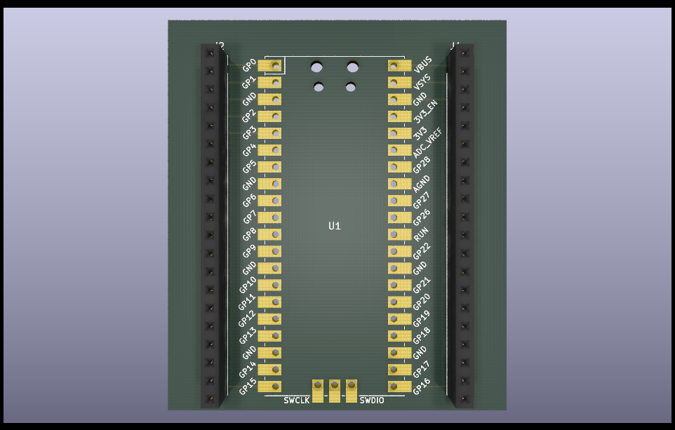

# RP2040_Dev_Board
Kicad PCB design for a RP2040 Development Board Designed to make the RP2040 more beginner friendly
## Features to Implement 
() Add 12V/5V and 3.3V Power  
() Add LEDs 
() Add slots for Basic sensors like DHT11, 22, LDR, etc. 
() Add motor driver for stepper, DC, BLDC etc.
() Add protection circuit
() Add I2C, SPI, UART interfaces in the form of connectors to communicate with external MCUs 
## Pico Pin Diagram

## Preview
 

